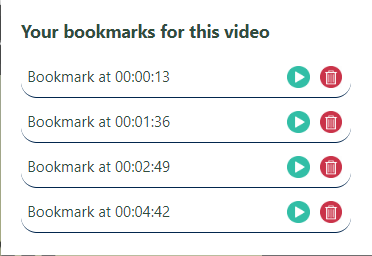
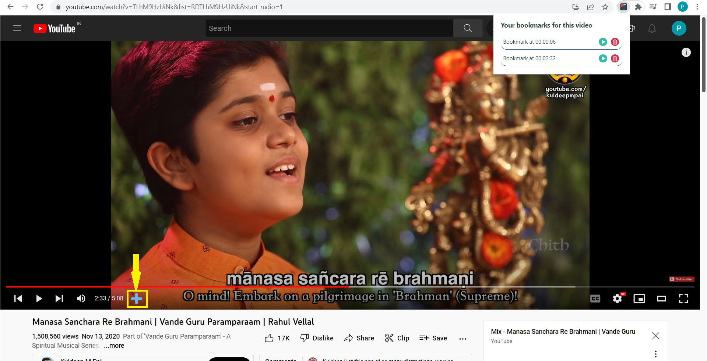

# youtube-bookmarker-extension
Chrome Plugin to bookmark timestamps of any youtube video.

## Introduction:
A chrome extension where a user can bookmark his favorite timestamps of any youtube video. A bookmark is mapped to an individual youtube video. Other options available for the user are play the video from timestamp of the saved bookmark and to delete a bookmark.

 

 

## Technologies Used:
 Majorly Javascript, html and css are being used for functionality. And to store the bookmarks chrome storage apis are used here, along with chrome extension framework to build the extension.

 

## To Add a Bookmark:
Once the extension is loaded, and if any youtube video is opened, you can see a plus icon appearing at the bottom menu of a video as highlighted below.

One can click on the icon to save a bookmark at the current time of the youtube video. 

 

# Technical Overview:

Below are some of important points related to implementation of the extension.

1. As explained earlier chrome storage apis(sync version) are used to store the bookmarks a user has created.
2. Each youtube url has a query parameter named 'v' which is unique for each video. We are using this property as a key in storage, and all bookmarks as values to it. 
3. There is a background script running(background.js) which on chrome tab update checks if the url is a youtube related one/not and if so passes the video details(videoId from the url and event type) to the current tab.
4. The details sent by background script are captured by current tab's content script and it adds the plus icon(<strong>+</strong>) which was highlighted earlier to the youtube video playing. The currentVideoId in content script is also updated by the videoId sent, so that any subsequent bookmark additions are stored properly.
5. On extension front, whenever the DOMContentLoaded event occurs it fetches the bookmark data by getting the currenttab url and processes that data and displays it as shown earlier.

 

## How To Load the extension:
To use the extension , one can follow these steps:

1. Download the whole folder from git and extract it
2. Open Chrome(or any chromium based browser like edge etc)
3. Type <strong>chrome://extensions/</strong> in the url bar which takes us to extension menu
4. Enable the developer mode on the top right corner
5. On enabling the developer mode one will be greeted with three options loadunpacked, pack extension and Update
6. Click on load unpacked and select the earlier extracted folder
7. Once that is done, you can access the extension like any other from the browser, and start using it!!

